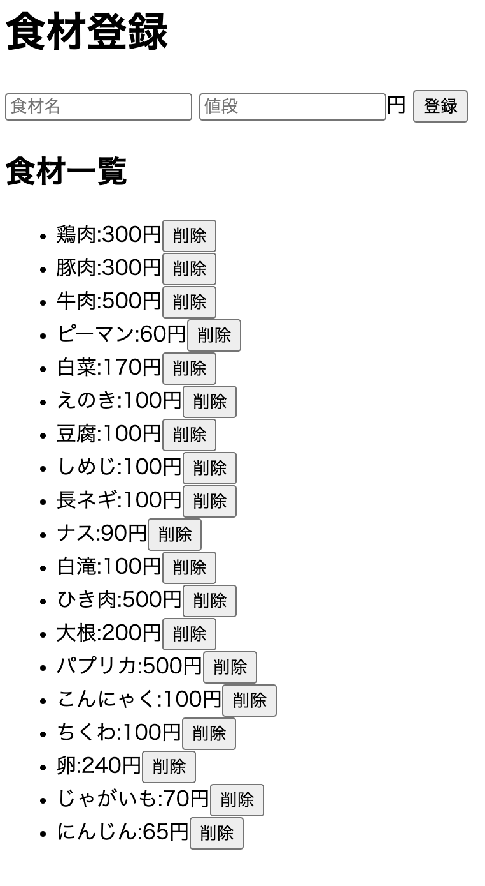
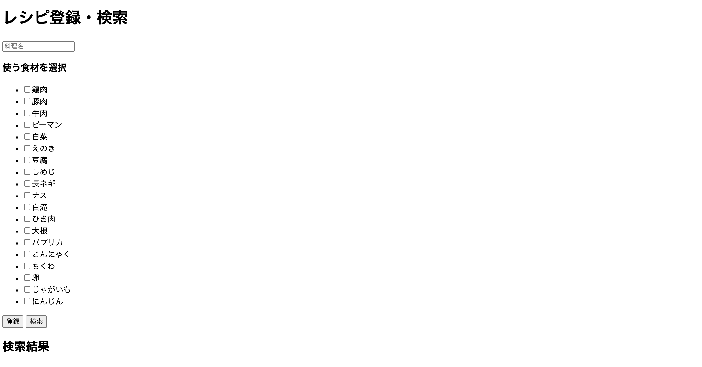
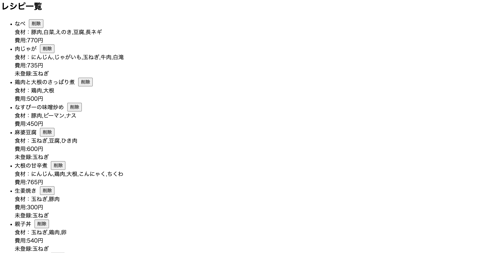
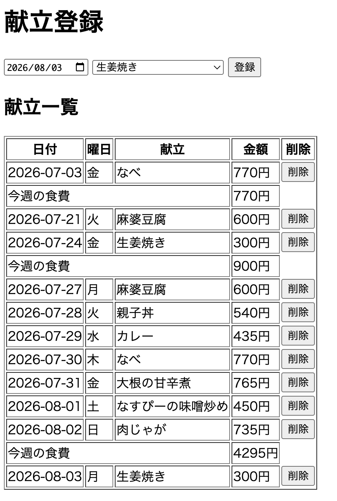
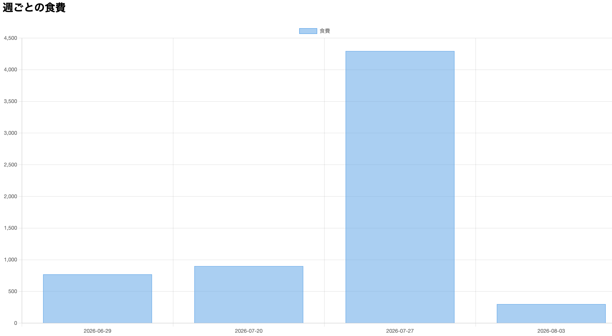

# メニュー管理アプリ

## 概要
JavaScript、HTML、CSSで作成した献立管理Webアプリです。
レシピ・食材・献立を一元管理し、週ごとの食費を集計・グラフ表示できます。

## 主な機能
- レシピ登録・編集・削除
- 食材登録・編集・削除
- 献立登録・編集・削除
- レシピ検索
- LocalStorageによるデータ保存
- 週ごとの食費集計
- Chart.jsによる食費推移グラフ表示

## 使用技術
- JavaScript
- HTML
- CSS
- Chart.js
- LocalStorage

## 画面イメージ

### 食材登録

### レシピ登録・検索

### レシピ一覧

### 献立登録

### 食費グラフ

